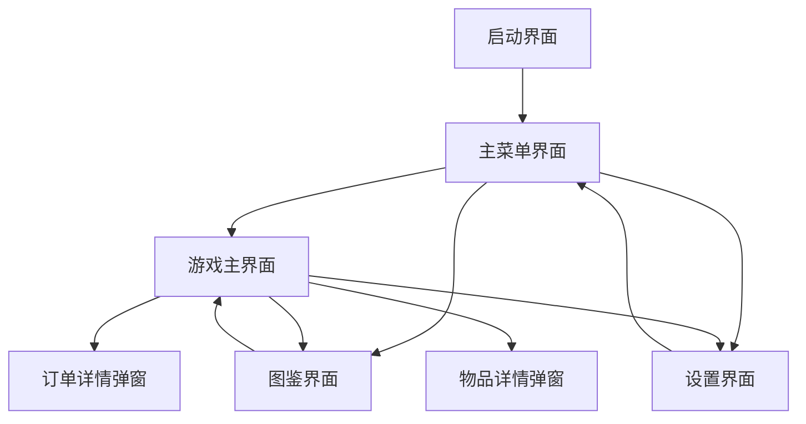
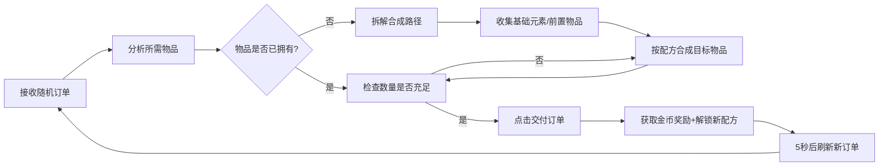

# 《像素炼金铺》游戏玩法详细文档

# 一、UI 架构与跳转设计

## （一）核心 UI 层级关系

## （二）关键跳转逻辑

1. **启动→主菜单**：启动游戏后播放 3 秒像素风格开场动画（炼金台合成闪光效果），自动跳转至主菜单，伴随轻柔的吉他主题 BGM。

2. **主菜单→游戏主界面**：点击 “开始经营” 按钮（64×64px 木质纹理图标），主菜单面板向下滑出屏幕，游戏场景渐入，同时切换为游戏内循环 BGM（加入炼金台冒泡音效）。

3. **游戏主界面→图鉴界面**：点击右上角 “图鉴” 按钮，主界面 UI 降低透明度（保留金币与订单提示），图鉴面板从右侧滑入，支持 “基础 / 中级 / 高级” 标签页切换。

4. **游戏主界面→订单详情**：顾客进店时自动弹出订单面板，或点击左侧 “订单” 图标手动调出，完成交付后面板自动收起并播放金币音效。

5. **任意界面→设置界面**：点击右上角 “齿轮” 图标，当前界面暂停交互，设置面板居中弹出，支持音量调节、画质切换与返回主菜单功能。

# 二、新手流程与核心操作

## （一）初始引导阶段（前 3 分钟）

1. **进入游戏**：加载完成后，主角（店主）站在合成台旁，系统自动弹出新手引导弹窗（羊皮纸风格），提示 “欢迎来到你的炼金铺！先尝试合成基础物品吧”。

2. **认识基础元素**：引导弹窗消失后，左侧材料栏自动解锁 “水、火、土、气”4 种基础元素（每种初始数量 3 个），鼠标悬停时显示元素名称与图标（64×64px）。

3. **首次合成教学**：
        系统通过箭头指引，提示 “将水和火拖入合成台”，此时合成台（位于场景中央）的 2 个格子高亮显示。

4. 玩家按住鼠标左键拖动 “水” 元素（蓝色水滴图标）至合成台格子，释放鼠标后播放轻微 “点击” 音效，格子显示水元素图标。

5. 重复操作拖入 “火” 元素，此时合成台下方的 “合成” 按钮（木质纹理 + 金色边框）亮起。

6. **完成首次合成**：
        点击 “合成” 按钮，合成台播放 5 帧闪光动画，伴随炼金台冒泡音效，同时显示 2 秒倒计时进度条。

7. 合成成功后触发屏幕轻微震动，生成 “蒸汽” 物品（半透明白色云朵图标），自动存入右侧物品栏，同时弹出提示 “解锁新物品：蒸汽！已记录至图鉴”。

8. **首个订单接收**：合成完成后，门口生成第一位顾客（老巫师形象），自动弹出订单面板：“需要 2 个蒸汽，限时 60 秒，奖励 100 金币”，顾客伴随 “ door creak ” 进店音效。

## （二）核心操作详解

### 1. 物品合成操作

|操作步骤|具体方式|反馈效果|
|---|---|---|
|选择材料|鼠标左键按住材料栏 / 物品栏中的元素 / 物品|物品跟随鼠标移动，播放 0.2 秒软点击音效|
|放置材料|将物品拖动至合成台格子（共 2 个基础格子，后期可解锁至 4 个）|格子显示物品图标，若放置错误可拖动至格子外取消|
|触发合成|材料满足配方条件时，“合成” 按钮亮起，点击即可|显示合成倒计时，播放冒泡音效|
|收取物品|合成完成后，物品自动存入物品栏，或手动拖动至指定位置|播放成功音效，解锁图鉴时弹出提示|
### 2. 订单交付操作

- **查看需求**：订单面板显示 “顾客形象、所需物品图标 + 数量、剩余时间、奖励金币” 四大要素，剩余 10 秒时倒计时数字变红并闪烁。

- **准备物品**：通过合成获取订单所需物品，物品栏中满足数量的物品会显示 “可交付” 标记。

- **完成交付**：点击订单面板底部 “交付” 按钮，若物品数量充足，物品自动扣除，奖励金币即时到账（金币数值跳动更新），播放 “ coin clinking ” 音效；若数量不足，按钮灰色不可点击，提示 “物品数量不足，请先合成”。

- **订单超时处理**：未在时限内完成，订单面板播放警告音效并闪烁，扣除 50 金币，顾客摇头离开，5 秒后自动刷新下一个订单。

### 3. 图鉴查阅操作

- **解锁查看**：首次合成的物品自动解锁图鉴条目，未解锁物品显示为灰色剪影，标注 “未发现”。

- **详情浏览**：点击图鉴中的物品图标，右侧显示详细信息：物品名称、合成配方（所需材料 + 数量）、解锁条件与关联订单，例如 “蒸汽：水 + 火，解锁基础元素后可合成”。

- **分类筛选**：通过顶部标签页切换 “基础（4 种）/ 中级（30 种）/ 高级（26 种）” 分类，已解锁物品按获取时间排序，支持鼠标滚轮滚动浏览。

# 三、游戏主界面布局详解（1920×1080 分辨率）

## （一）场景核心区域（占屏 70%）

- **合成台区域**：位于场景中央，由 2 个（后期可升级至 4 个）物品格子组成（每个 80×80px），格子下方设 “合成” 按钮与倒计时进度条，合成时显示动画效果，是核心交互区域。

- **顾客区域**：场景左侧门口设顾客生成点，顾客出现时站在柜台前（场景左侧），头顶显示对话气泡（标注订单状态：等待 / 交付 / 离开）。

- **货架区域**：场景右侧设 3 层货架，已解锁的高级物品会以像素模型形式陈列（如蒸汽机、高级药剂等），增强场景沉浸感。

## （二）UI 功能模块分布

1. **顶部信息栏（高度 80px）**：
        左侧：金币数量显示（金色数字 + 钱袋图标），数值变化时播放跳动动画。

2. 中间：当前日期 / 营业时间（像素风格字体，无实际功能，增强氛围）。

3. 右侧：“图鉴”“设置” 两个功能按钮（各 64×64px），鼠标悬停时放大 10%。

4. **左侧材料栏（宽度 120px）**：
        顶部标注 “基础元素” 标题（羊皮纸纹理背景）。

5. 下方以 2×2 网格排列 4 种基础元素图标（64×64px），每个图标右下角显示剩余数量（白色数字），数量为 0 时图标灰度显示并加锁。

6. **右侧物品栏（宽度 180px）**：
        顶部标注 “已合成物品” 标题，设 “全部 / 可交付” 筛选按钮。

7. 下方以 3×4 网格排列合成物品（64×64px），支持滚动查看，鼠标悬停显示物品名称与数量，可拖动至合成台用于进阶合成。

8. **左侧订单面板（宽度 384px，默认隐藏）**：
        羊皮纸纹理背景，顶部显示 “顾客订单” 标题，配羽毛笔像素图标。

9. 中间区域显示：顾客头像（64×64px）、所需物品图标 + 数量（如 “蒸汽 ×2”）、剩余时间（红色数字倒计时）。

10. 底部设 “查看详情”（左）与 “交付”（右）两个按钮，按钮尺寸 64×64px，交付按钮在条件满足时亮起。

11. **底部快捷栏（高度 100px，后期解锁）**：
        包含 “快速合成”“自动交付” 等付费解锁功能按钮（初期隐藏），以及 “背包扩容”“合成台升级” 等成长系统入口。

# 四、核心玩法循环与成长体系

## （一）基础玩法闭环（单次循环 3-5 分钟）

## （二）关键成长驱动

1. **配方解锁机制**：
        基础配方（4 种元素）初始解锁；中级配方（如蒸汽、齿轮等 30 种）需完成对应初级订单解锁，例如 “交付 2 个蒸汽后解锁‘蒸汽机’配方”；高级配方（如高级机械、魔法药剂等 26 种）需解锁全部中级物品后逐步开放。

2. 配方解锁时弹出提示 “新配方解锁：蒸汽 + 齿轮 = 蒸汽机”，同时图鉴自动更新对应条目。

3. **订单难度梯度**：
        前期（1-10 级订单）：仅需 1-2 步合成，如 “水 + 土 = 泥浆”“火 + 气 = 火焰弹”，时限 60-90 秒，奖励 100-200 金币。

4. 中期（11-20 级订单）：需 3 步合成，如 “蒸汽 + 齿轮 = 蒸汽机 + 金属 = 机械臂”，时限 120-180 秒，奖励 300-500 金币。

5. 后期（21-30 级订单）：需 4 步以上合成，涉及高级物品组合，时限 200-300 秒，奖励 600-1000 金币，部分订单附加 “品质要求”（需合成高星级物品）。

6. **店铺成长系统**：
        金币用途：升级合成台（从 2 格扩展至 4 格，减少合成耗时）、扩容物品栏（初始 12 格，最高 36 格）、解锁货架装饰（提升顾客满意度，缩短订单刷新时间）。

7. 图鉴收集奖励：每收集 10 种物品，解锁特殊 BGM 或场景装饰（如魔法吊灯、自动售货机），全部 60 种物品收集完成后解锁 “大师炼金师” 称号与隐藏皮肤。

## （三）风险与策略平衡

- **资源管理**：基础元素每 30 秒自动恢复 1 个，上限 10 个，需合理规划合成顺序，避免 “卡材料” 导致订单超时。

- **订单取舍**：后期可同时接收 2 个订单（需升级柜台），但需权衡时限与合成复杂度，超时扣除的金币可能抵消奖励，考验玩家优先级判断能力。

- **隐藏彩蛋**：特定物品组合（如 “土 + 气 + 火 + 水”）可合成 “ Philosophers' Stone ”（贤者之石），解锁无限基础元素供应，但触发条件需通过图鉴线索推理，增强探索乐趣。

注：文档部分内容可能由 AI 生成
> （注：文档部分内容可能由 AI 生成）