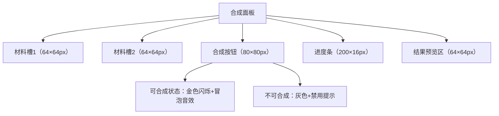
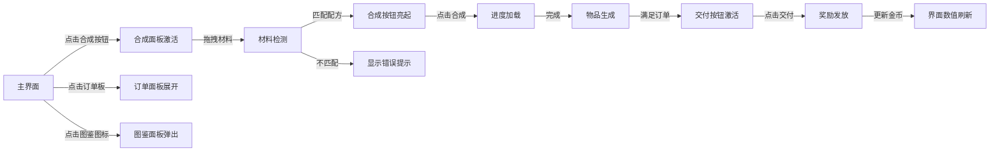

# 《像素炼金铺》界面、UI 与游戏场景设计文档

## 一、视觉风格总规范

### 1. 核心风格定义

* **美术风格**：复古 16 位像素风，暖棕色为主色调（#8B5A2B 为基础色），搭配橙红（#CD5C5C）、淡蓝（#87CEEB）辅助色，符合炼金场景温暖治愈感

* **技术基准**：界面分辨率 1920×1080，角色 / 物品 64×64px，场景 Tile 32×32px，所有元素边缘像素抗锯齿处理

* **统一规范**：图标采用扁平化设计，阴影偏移 2px，UI 边框为 2px 金色描边（#D4AF37）

### 2. 字体与图标规范

| 元素类型   | 字体选择          | 尺寸 / 像素 | 颜色规范          |
| ------ | ------------- | ------- | ------------- |
| 主标题    | Pixelify Sans | 48px    | #D4AF37（金边描黑） |
| 功能按钮文本 | Pixelify Sans | 24px    | #FFFFFF       |
| 物品名称   | Pixelify Sans | 18px    | #333333       |
| 订单描述   | Pixelify Sans | 16px    | #5A3921       |
| 功能图标   | 自定义像素图标       | 64×64px | 暖色调渐变         |

## 二、游戏场景设计

### 1. 核心场景布局（炼金铺室内）

#### （1）场景尺寸与分区

* 整体尺寸：48×32 Tile（1536×1024px），适配 1920×1080 界面居中显示

* 三大功能区：

1. 合成区（左侧）：12×16 Tile，放置炼金台（4×4 Tile）、材料柜（3×6 Tile）

2. 订单区（右侧）：10×16 Tile，含顾客等候位（2×3 Tile）、订单公告板（3×4 Tile）

3. 仓储区（后方）：16×12 Tile，多层货架（每架 4×8 Tile），陈列已合成物品

#### （2）场景元素细节

| 区域  | 核心元素 | 视觉描述                                    | 交互属性    |
| --- | ---- | --------------------------------------- | ------- |
| 合成区 | 炼金台  | 32×32px 石质台面，中央有冒泡坩埚动画（8 帧循环），台边 3 个材料槽 | 可拖拽放置物品 |
| 合成区 | 材料柜  | 木质纹理，3 层抽屉，每层 6 个材料格，未解锁材料格显示灰色蒙版       | 点击展开材料库 |
| 订单区 | 公告板  | 羊皮纸纹理面板，钉有 3 张订单卡片，超时订单边缘闪烁红光           | 点击查看详情  |
| 仓储区 | 货架   | 深色木质，每层放置 6 个物品展示位，已解锁物品显示彩色图标，未解锁为轮廓   | 点击取放物品  |
| 入口区 | 店门   | 双开木门，顾客进入时播放开门动画（3 帧）+ 门轴吱呀音效           | 自动触发事件  |

#### （3）动态场景元素

* 环境动效：屋顶悬挂油灯每 2 秒闪烁一次（亮度 ±10%），墙面烛台火焰 8 帧循环动画

* 交互反馈：合成成功时炼金台喷发闪光粒子（5 帧动画），伴随地面蒸汽扩散效果

* 角色动线：顾客从店门进入后沿固定路径（橙色 Tile 标记）移动至等候位，停留时播放 idle 动画

### 2. 场景 Tile 集规范

* 基础 Tile 分类：

1. 地面 Tile：木质地板（3 种纹理变体）、石质地面（合成区专用）

2. 墙面 Tile：石砌墙（带窗户）、木质隔墙（仓储区）

3. 装饰 Tile：货架层板、柜台边缘、油灯吊架（含光源效果）

* 拼接要求：所有 Tile 边缘像素对齐，墙角采用 45° 转角 Tile 过渡，避免拼接缝隙

## 三、界面与 UI 设计

### 1. 主界面布局（游戏运行时）

#### （1）顶部信息栏（1080×80px）

* 左侧：金币显示区（120×80px），金币图标（64×64px）+ 数字文本（48px），数值变化时播放弹跳动画

* 中间：时间 / 进度提示（240×80px），合成中显示倒计时（红色数字），空闲时显示当前时段（如 “午后”）

* 右侧：功能入口（3×80px）：图鉴（64×64px）、设置（64×64px）、背包（64×64px），hover 时放大 1.1 倍

#### （2）中部交互区（核心功能区）

* 合成面板（左侧固定）：512×384px，木质边框 + 玻璃视窗，含：

  * 材料槽：2 个 64×64px 圆形槽位，未放材料时显示灰色轮廓，放材料后显示物品图标 + 数量

  * 合成按钮：80×80px 圆形按钮，常态为棕木色，可合成时变为金色（带闪烁效果）

  * 进度条：200×16px，暖橙色填充，合成时匀速增长，末端有火花粒子

* 订单面板（右侧可折叠）：384×512px，羊皮纸纹理，含：

  * 顾客头像（64×64px）：显示当前顾客形象，下方标注姓名

  * 需求列表：3 行物品栏，每行含 64×64px 图标 + 数量文本 + 时限倒计时

  * 交付按钮：80×32px，满足条件时亮起，点击播放交付动画

### 2. 核心功能面板设计

#### （1）合成面板（场景左侧固定）

* 交互逻辑：拖拽材料至槽位→系统匹配配方→可合成时按钮激活→点击合成→进度条加载→生成物品至预览区→自动存入仓储区

#### （2）图鉴面板（可呼出）

* 尺寸：768×640px，三层标签页（基础 / 中级 / 高级），含：

  * 分类标签：每个标签 48×24px，选中时底色变为金色

  * 物品网格：10×6 网格布局，每个格子 64×64px，未解锁物品显示暗纹轮廓 + 锁图标

  * 详情弹窗：256×256px，显示物品图标（96×96px）、合成配方、解锁条件

#### （3）订单面板（右侧可折叠）

| 状态   | 视觉变化                          | 交互反馈                         |
| ---- | ----------------------------- | ---------------------------- |
| 新订单  | 面板从右侧滑入，伴随纸张展开音效，订单卡片轻微弹跳     | 点击面板展开详情，显示顾客对话气泡（如 “急需蒸汽！”） |
| 合成中  | 所需物品图标旁显示进度圈（蓝色填充），时限文本为黑色    | 鼠标悬停显示 “剩余 XX 秒” 提示          |
| 即将超时 | 时限文本变为橙色，每 1 秒闪烁一次，播放倒计时音效    | 点击 “加急合成” 消耗金币缩短时间           |
| 已超时  | 面板边缘闪烁红光，订单卡片变为灰色，显示 “已失效” 字样 | 自动扣除违约金，5 秒后滑出界面             |

### 3. 辅助 UI 模块

#### （1）拖拽反馈系统

* 拖拽中：物品图标放大至 80×80px，底部显示半透明阴影，跟随鼠标移动

* 有效区域：材料槽高亮（绿色边框闪烁），可放置时图标变为半透明

* 无效区域：图标显示红色禁止符号，播放错误音效（0.2 秒短促提示音）

#### （2）提示与动效模块

* 成就提示：右下角弹出 320×120px 卡片，显示 “解锁新物品！”+ 图标，3 秒后向上滑出

* 错误提示：合成区上方显示 240×60px 红色面板，文本 “材料不足”/“配方不存在”，1.5 秒后渐隐

* 动效触发点：

  * 合成成功：闪光动画（5 帧）+ 屏幕震动（强度 0.1，0.5 秒）+ 成功音效

  * 订单交付：金币粒子喷射（10 个粒子）+ 硬币碰撞音效

  * 图鉴解锁：图标从暗到亮渐变（0.3 秒）+ 解锁提示音

## 四、界面交互流程图

## 五、技术落地说明

### 1. UI 适配要点

* 锚点设置：所有 UI 元素锚定至对应父级面板，合成面板锚定左中，订单面板锚定右中

* 缩放规则：支持 16:9/4:3 分辨率自适应，按钮尺寸最小不低于 48×48px

* 触摸兼容：预留触屏拖拽区域，材料槽点击区域扩大至 80×80px（含边缘 20px 热区）

### 2. 性能优化规范

* 动画管理：所有重复动效（如火焰、冒泡）使用动画状态机，闲置时暂停

* 面板加载：非即时显示面板（如图鉴）采用异步加载，初始仅加载当前分类物品

* 粒子控制：合成闪光粒子数量限制为 20 个 / 次，播放后自动回收至对象池

> （注：文档部分内容可能由 AI 生成）