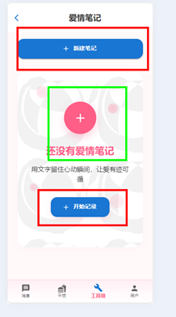

# 任务记录

## 周任务（2025.5.28-2025.6.4）

`任务1:`

这个菜品制作步骤没有显示完全。而且食材，功效，花费。没有显示完全。优化这个卡片让所有内容都可以正常显示。可以根据自己的想法优化卡片

**需要修改的页面：DishPage**

`任务2:`
情侣记账页面的类别头像配色不对，导致头像里面的字看不清楚

**需要修改的页面：AccountPage**

`任务3:`
在没有任何情侣笔记的时候会有三个新建笔记的地方。需要删除上下多余的。而且中间的红色加号目前没有设置成点击之后可以添加笔记，需要点击红色加号后也能新增笔记。修复请输入笔记标题的错误信息

**需要修改的页面：LoveNotesPage**

`任务4:`
在工具箱中，小星星的游戏可以删除掉。

效果是界面不显示这个图标即可，不要删除 StarGame.jsx 这个文件。
**需要修改的页面：ToolPage**

`任务5:`（长期）
学习 react 基本概念。[官方文档](https://react.docschina.org/learn)
粗略浏览即可。后续有概念性的问题可以询问 Ai 或者查阅官方文档

组件库 mui/material

`任务6:`
dish 页面的步骤下面显示出了两个花费。修复 bug

**需要修改的页面：DishPage**

`任务7:`
好友列表页面中我的好友和好友申请的标签，选中哪一个的话可以有不一样的颜色或者样式区分。

**需要修改的页面：MessagePage,ChatListPage**

`任务8:`（微难）
干饭里面的餐厅页面。优化页面，布局优化成类似于美团点饭的风格，同时主配色保持和恋爱记一致。

**需要修改的页面：OrderingPage**

`任务9:`（重要）
电脑端聊天输入框无法输入文字，需要修复一下。

**需要修改的页面：ChatPage**

# 任务记录

## 周任务（2025.6.9-2025.6.16）

`任务1:`

a.优化美味餐厅点餐页面。模仿美团页面。

b.结算按钮增加与后端的交互。调用/dish/order 接口来进行结算。
请求方式 POST
请求参数：
{
"totalSlackerValue":"xxxx",
"dishInfo":[
{"dishId":"xxxx",
"number":"xx"},
{"dishId":"xxxx",
"number":"xx"}
]
}

totalSlackerValue 表示总的不劳而获值。
dishInfo 表示点的菜的信息。dishId 表示菜品 id。number 表示菜品数量。(不懂这个请求参数的结构的话可以询问 AI)

**需要修改的页面：OrderingPage**
